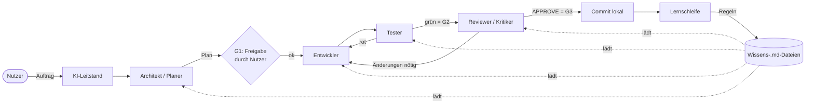
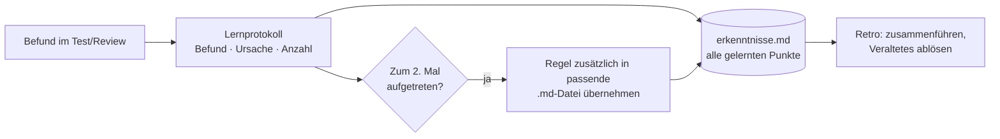

# KI-Kernarchitektur für die Weiterentwicklung

Vier spezialisierte KI-Rollen entwickeln die Software und ihre Module gemeinsam weiter.
Ein Leitstand koordiniert sie, feste Qualitätstore sichern das Ergebnis, und eine
Lernschleife verbessert die Regeldateien (`.md`) nach jedem Arbeitspaket.

## 1. Ziele

- **Qualität vor Tempo:** Keine Änderung ohne Plan, Test und unabhängiges Review.
- **Getrennte Verantwortung:** Wer Code schreibt, prüft ihn nicht selbst.
- **Lernendes System:** Fehler werden einmal gemacht, danach steht eine Regel in der passenden Datei.
- **Sparsamer Kontext:** Jede Rolle lädt nur das Wissen, das sie gerade braucht.
- **Mensch entscheidet:** Plan-Freigabe, Eskalationen, Push und Release bleiben beim Menschen.

## 2. Überblick

## 3. Rollen

| Rolle | Aufgabe | Darf | Darf nicht | Ergebnis |
|---|---|---|---|---|
| **KI-Leitstand** | Ablauf steuern, Rollen aufrufen, Tore prüfen, Schleifen begrenzen | Arbeitspaket-Datei führen, Subagenten starten, lokal committen | Code schreiben, Tore überspringen, pushen | Arbeitspaket mit Status, Abschlussbericht |
| **Architekt / Planer** | Anforderung klären, Code analysieren, Lösung entwerfen | Lesen, Suchen, Web-Recherche, Plan schreiben | Produktivcode ändern | Plan mit Schritten, Risiken, Abnahmekriterien |
| **Entwickler** | Plan umsetzen, kleinste sinnvolle Änderung | Code ändern, Befehle ausführen | Plan eigenmächtig erweitern, Tests abschwächen | Umsetzungsnotiz, grüne Prüfungen |
| **Tester** | Abnahmekriterien in Tests übersetzen, Regressionen finden | Nur `tests/` ändern, Tests ausführen | Produktivcode ändern | Testbericht (neu/geändert, Ergebnis SQLite + PG) |
| **Reviewer / Kritiker** | Unabhängig und kritisch prüfen | Lesen, Analysewerkzeuge ausführen, Review-Abschnitt schreiben | Code oder Tests ändern | Urteil `APPROVE` / `CHANGES_REQUESTED` mit belegten Befunden |

Leitgedanke: **Der Reviewer sucht aktiv nach Gründen, warum die Änderung falsch ist** –
belegt mit Datei und Zeile. Geschmacksfragen sind nie Blocker.

Die Rollen liegen als Custom Agents in `.github/agents/` und sind einzeln (Agentenauswahl im
Chat) oder über den Leitstand als Subagenten nutzbar. Jede Rolle hat nur die Werkzeuge,
die sie braucht; Übergaben erfolgen per Handoff-Schaltfläche oder durch den Leitstand.

## 4. Ablauf und Qualitätstore

| Schritt | Rolle | Tor | Kriterium |
|---|---|---|---|
| 1. Auftrag erfassen, Arbeitspaket anlegen | Leitstand | – | Datei `.github/ki/arbeitspakete/AP-…md` existiert |
| 2. Planen | Architekt | **G1** | Nutzer gibt Plan frei |
| 3. (nur Bugfix) reproduzierenden Test schreiben | Tester | – | Test ist rot und zeigt den Fehler |
| 4. Umsetzen | Entwickler | – | PHPStan ohne neue Baseline-Einträge |
| 5. Testen | Tester | **G2** | Alle Tests grün (SQLite; bei SQL-/Schema-Änderung auch PostgreSQL) |
| 6. Prüfen | Reviewer | **G3** | Urteil `APPROVE`, keine Blocker/Major-Befunde |
| 7. Abschluss | Leitstand | – | Conventional Commit lokal, Befunde ins Lernprotokoll, gelernte Punkte in `erkenntnisse.md` |

**Schleifenbremse:** Maximal 3 Runden Entwickler ↔ Tester und 3 Runden Entwickler ↔ Reviewer.
Danach eskaliert der Leitstand an den Nutzer (mit Zusammenfassung, was offen ist und warum).

## 5. Wissensschichten (die `.md`-Dateien)

Wissen ist nach Ladezeitpunkt geschichtet. Je weiter oben, desto kürzer muss die Datei sein,
weil sie häufiger im Kontext landet.

| Ebene | Datei(en) | Wird geladen | Inhalt | Budget |
|---|---|---|---|---|
| 0 Projekt | `AGENTS.md` | immer | Befehle, unverhandelbare Regeln, Verweise | ≤ 50 Zeilen |
| 1 Dateibezogen | `.github/instructions/*.instructions.md` | bei passenden Dateien (`applyTo`) | PHP-Backend, Migrationen, Tests, Frontend, Struktur, KI-Dateien | ≤ 40 Zeilen je Datei |
| 2 Fähigkeiten | `.github/skills/<name>/SKILL.md` | bei Bedarf (Beschreibung passt) | Mehrschrittige Abläufe, z. B. Modul anlegen | ≤ 120 Zeilen |
| 3 Rollen | `.github/agents/*.agent.md` | wenn Rolle aktiv | Rollenauftrag, Grenzen, Ausgabeformat | ≤ 80 Zeilen |
| 4 Erkenntnisse | `.github/ki/erkenntnisse.md` | vor Arbeitsbeginn, je Rolle die betroffenen Kategorien | **Alle gelernten Punkte** mit Nr., Regel, Begründung, Quelle | nach Kategorien gegliedert |
| 5 Arbeitsgedächtnis | `.github/ki/arbeitspakete/`, `.github/ki/lernprotokoll.md` | vom Leitstand/Rollen gezielt | Pläne, Berichte, Rohbefunde, Kennzahlen | – |
| Referenz | `docs/*.md`, `../copier-astral-main/template/` | per Verweis | Entwicklerdoku, Strukturvorlage | – |

Grundregel: **Verweisen statt kopieren.** Steht etwas in `docs/entwicklung.md`, verweisen die
KI-Dateien darauf und enthalten nur die Punkte, die KI-Agenten erfahrungsgemäß falsch machen.

## 6. Strukturvorlage copier-astral

Aufbau und Strukturen der Software werden nach der Vorlage
[copier-astral](https://github.com/ritwiktiwari/copier-astral) (lokal `../copier-astral-main/template/`)
geplant und gebaut. Die Vorlage ist für Python; übernommen werden Aufbau, Namen und Abläufe,
die Werkzeuge werden durch PHP-Gegenstücke ersetzt (Composer statt uv, PHP-CS-Fixer statt ruff,
PHPStan statt ty, PHPUnit statt pytest, `bin/console` statt Typer-CLI).

- Die vollständige Abbildung Vorlage → Baukalkulation steht in
  `.github/instructions/struktur.instructions.md` und wird bei Struktur-, Tooling-, CI- und Doku-Änderungen
  automatisch geladen.
- **Architekt:** plant jede neue Datei, jeden Ordner, jedes Make-Target, jeden CLI-Befehl und CI-Job
  nach der Vorlage und nennt Abweichungen mit Begründung im Plan.
- **Reviewer:** prüft Struktur-Konformität als eigenen Punkt der Prüfliste.
- **Retro:** Stichprobe gegen die Vorlage; dauerhafte Abweichungen werden in der Abbildungstabelle festgehalten.
- Bleibende Besonderheiten der Baukalkulation: Webroot `public/`, Modulsystem, SQLite + PostgreSQL, `deploy/`-Spiegel.

## 7. Lernschleife – besser und effizienter werden

1. **Erfassen:** Jeder Blocker/Major-Befund und jeder rote Testlauf, der auf fehlendes Wissen
   zurückgeht, wird im Lernprotokoll festgehalten (Leitstand, Schritt 7).
2. **Hinterlegen:** Jeder gelernte Punkt kommt sofort als nummerierter Eintrag (`E-Nr`) in die
   separate Datei `.github/ki/erkenntnisse.md` – gegliedert nach Kategorien, mit Regel, Begründung
   und Quelle. Sie ist die vollständige Wissensbasis des Teams; alle Rollen lesen sie vor Arbeitsbeginn.
3. **Verdichten (2-mal-Regel):** Tritt dieselbe Ursache ein zweites Mal auf, wird die Erkenntnis
   zusätzlich als einzeilige Regel dort verankert, wo sie automatisch geladen wird; die Spalte
   „Umgesetzt in“ verweist darauf.
4. **Richtig einsortieren:** Gilt die Regel für alle Aufgaben → `AGENTS.md`; für bestimmte
   Dateien → `*.instructions.md`; für eine Rolle → `*.agent.md`; für einen Ablauf → Skill.
5. **Aufräumen (Retro):** Alle 5 Arbeitspakete oder bei Budgetüberschreitung `/retro` ausführen:
   Erkenntnisse zusammenführen, Überholtes nach „Abgelöst“ verschieben, Budgets einhalten, Kennzahlen fortschreiben.
6. **Sicherheitsnetz:** Änderungen an KI-Dateien laufen wie Code über Git (eigener
   `docs(ki):`-Commit) und sind damit nachvollziehbar und rücknehmbar.

### Kennzahlen (im Lernprotokoll)

| Kennzahl | Bedeutung | Ziel |
|---|---|---|
| Review-Runden je Arbeitspaket | Wie oft musste nachgebessert werden | ≤ 1,5 im Schnitt |
| Erster Testlauf grün | Qualität der Umsetzung | ≥ 70 % |
| Blocker/Major je Kategorie | Wo fehlt Wissen (SQL, Sicherheit, Backup, Frontend …) | sinkend |
| Eskalationen an Nutzer | Schleifenbremse gegriffen | selten, jeweils mit Lernpunkt |
| Zeilen in Ebene 0–1 | Kontextkosten | innerhalb Budget |

## 8. Umsetzung in Stufen

| Stufe | Inhalt | Status |
|---|---|---|
| 1 Grundgerüst | `AGENTS.md`, 6 Instructions (inkl. Struktur), 5 Agents, Skill *modul-anlegen*, Vorlage, Lernprotokoll, `erkenntnisse.md`, `/retro` | angelegt |
| 2 Einschwingen | Erstes Arbeitspaket: Struktur-Abgleich gegen copier-astral (Lücken schließen); danach 3–5 echte Arbeitspakete, erste Retro, Regeln schärfen | nächster Schritt |
| 3 Erzwingen | Hooks statt Bitten: Tester darf nur `tests/` schreiben, Reviewer nichts; `php-cs-fixer` nach Edits; Blockade gefährlicher Befehle (`push`, `reset --hard`) | geplant |
| 4 Optimieren | Unterschiedliche Modelle je Rolle (Reviewer ≠ Entwickler reduziert blinde Flecken), weitere Skills (Release, Datenbank-Transfer), ggf. MCP für Issues | geplant |

## 9. Erweiterung

- **Neue Module:** Skill `modul-anlegen` (Manifest, Backend-Klasse, Frontend, Rechte, Tests).
  Modul-spezifische Regeln als eigene Instructions mit `applyTo: "**/modules/<name>/**"`.
- **Neue Rolle:** Nur wenn eine bestehende Rolle dauerhaft überladen ist (z. B. *Sicherheits-Auditor*
  oder *Doku-Autor*). Neue `.agent.md` nach dem Muster der bestehenden, im Leitstand in `agents:` eintragen.
- **Neue Regeln:** Ausschließlich über die Lernschleife – nie spekulativ „auf Vorrat“.

## 10. Nutzung

- **Komplett:** Im Chat den Agenten **KI-Leitstand** wählen und den Auftrag beschreiben.
- **Einzeln:** Agent **Architekt** wählen; danach über die Handoff-Schaltflächen weiter zu
  Entwickler → Tester → Reviewer.
- **Retro:** `/retro` im Chat.

## 11. Grenzen und Sicherheit

- Keine Kundendaten, Passwörter oder Inhalte aus `data/` in Arbeitspakete, Tests oder Regeln.
- Kein `git push`, kein Umschreiben der Historie, kein Löschen fremder Dateien ohne Rückfrage.
- Die KI-Dateien liegen in `.github/` und `AGENTS.md` und gelangen nicht in `deploy/`.
